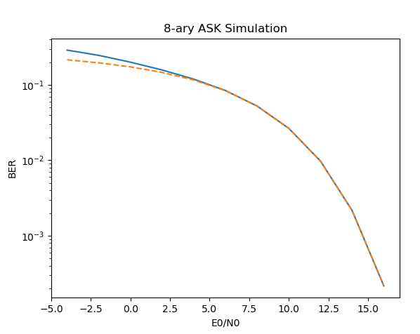

# M-ary-ASK-Simulation
Simulation and analysis of the Amplitude Shift Keying (ASK) and its Bit Error Rate (BER) for 8-ary case.

## Table of Contents
- [Prerequisites](#prerequisites)
- [Run](#run)
- [Expected output](#expected-output)
- [Important Equations](#important-equations)

## Prerequisites
1. Python
2. numpy, matplotlib and scipy

## Run
Run the following command for Windows or Linux in this directory. where 1000000 is the number of random decoded bits
```sh
$ python main.py 1000000
```

## Expected output
The solid line is the simulated BER and the dash line is the theoretical BER.
<p align="center">
	
</p>

## Important Equations
1. Eb = E0 * summation(ai^2)/N , where N is the total number of bits. In this example assume Eb = 1 to get E0.
2. SNR = Eb/N0.
3. Variance = N0/2.
4. Standard Deviation = sqrt(Variance).
